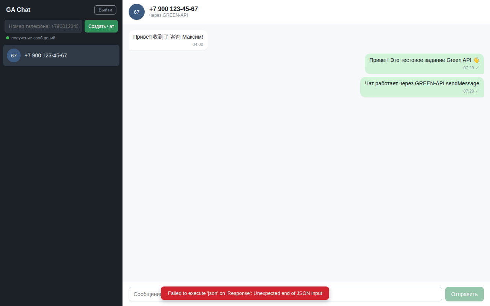
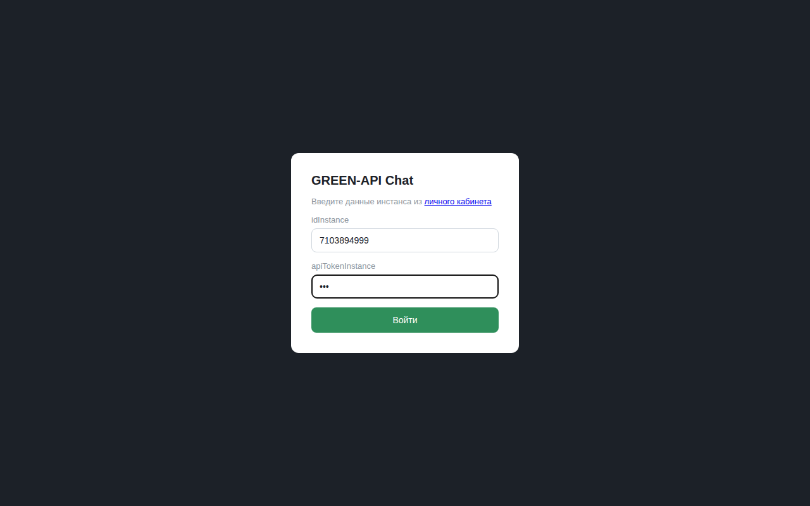
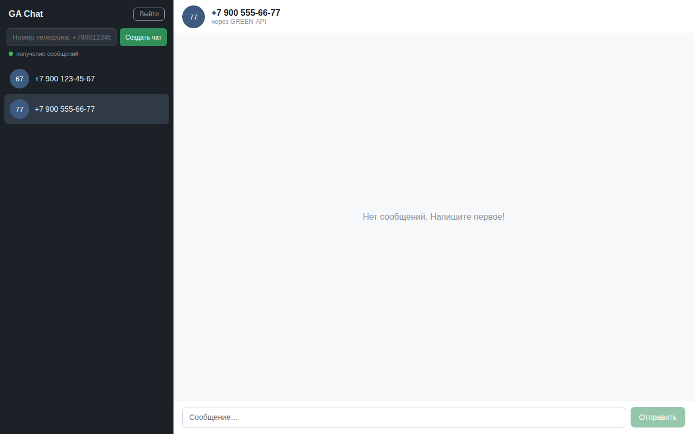

# GREEN-API Chat

Чат для обмена текстовыми сообщениями в мессенджерах **MAX** (и WhatsApp) через [GREEN-API](https://green-api.com/max). Тестовое задание на позицию «Фронтенд разработчик React».

React + Vite + TypeScript, без UI-библиотек и лишних зависимостей. Внешний вид — минималистичный прототип в духе [web.max.ru](https://web.max.ru/): тёмная левая панель со списком чатов, центральная область с пузырями сообщений (свои — справа, чужие — слева), поле ввода с кнопкой отправки.

## Скриншоты

| Логин | Чат |
|---|---|
|  |  |

| Заполненная форма | Список чатов |
|---|---|
|  |  |

## Возможности

- **Вход по данным инстанса GREEN-API**: `idInstance` + `apiTokenInstance` (проверяются методом `getStateInstance`; при неверном токене показывается понятная ошибка).
- **Список чатов** + создание нового чата по номеру телефона получателя (форматы `+79001234567`, `8 900 123-45-67`, `9001234567` — нормализуются автоматически).
- **Отправка текстовых сообщений** — метод [SendMessage](https://green-api.com/v3/docs/api/sending/SendMessage/):
  `POST https://api.green-api.com/waInstance{idInstance}/sendMessage/{apiTokenInstance}` с телом `{"chatId": "<phone>@c.us", "message": "<text>"}`.
  Исходящие показываются сразу (optimistic) со статусами ✓ (отправлено) / 🕓 (в очереди).
- **Получение сообщений** — HTTP API [receiveNotification](https://green-api.com/v3/docs/api/receiving/technology-http-api/): polling `DELETE …/receiveNotification/{apiTokenInstance}` каждые 4 секунды. Входящие текстовые и подтверждения исходящих (`outgoingAPIMessageReceived`, статусы `sent/delivered/read`) отображаются в соответствующем чате; чаты входящих сообщений добавляются в список автоматически.
- Обработка ошибок: неверный токен (401/403), инстанс не авторизован, ошибки сети — показываются в баннере и на экране входа.

## Локальный запуск

Требуется Node.js 18+.

```bash
npm install
npm run dev        # http://localhost:5173
```

Продакшен-сборка и тесты:

```bash
npm run build      # tsc + vite build -> dist/
npm test           # vitest: форматирование номера, парсинг notification
```

## Как получить idInstance и apiTokenInstance

1. Зарегистрируйтесь в личном кабинете [console.green-api.com](https://console.green-api.com) (тариф «Разработчик» — бесплатный).
2. Создайте инстанс для MAX (или WhatsApp) и авторизуйте его (QR-код).
3. В карточке инстанса скопируйте **idInstance** и **apiTokenInstance** и введите их на экране входа.

## Ограничения

- Только текстовые сообщения (по условию задания). Медиа, группы, аватарки — вне скоупа.
- GREEN-API разрешает прямые запросы из браузера (CORS), поэтому бэкенд не нужен; но токен хранится в памяти вкладки и покидает браузер только в запросах к api.green-api.com.
- Данные чатов не сохраняются между перезагрузками страницы (нет backend/БД).
- Polling каждые ~4 сек: на тарифе «Разработчик» лимита receiveNotification хватает с запасом, но при простое вкладки браузер троттлит таймеры.
- Для MAX идентификатор чата может отличаться от `@c.us` (см. [доку GREEN-API про chatId в MAX](https://green-api.com/v3/docs/faq/identifier-in-max/)); входящие такие chatId нормализуются к единому ключу.

## Структура

```
src/
  lib/greenApi.ts      — клиент GREEN-API (sendMessage, receiveNotification, getStateInstance)
  lib/notification.ts  — типы и парсинг notification-ов
  lib/phone.ts         — нормализация номера -> chatId
  components/          — LoginScreen, Sidebar, ChatWindow
tests/                 — vitest-тесты логики
docs/                  — скриншоты
scripts/shots.py       — генерация скриншотов (playwright + мок fetch)
```
